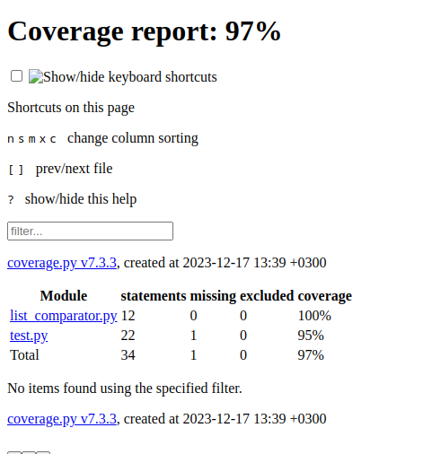

### Код программы: list_comparator.py

    class ListComparator:
    """
    Этот класс сравнивает два списка и определяет, какой из них имеет большее среднее значение.
    """

    def __init__(self, list1, list2):
        self.list1 = list1
        self.list2 = list2

    def calculate_average(self, lst):
        """
        Вычисляет среднее значение для заданного списка.
        """
        return sum(lst) / len(lst)

    def compare_lists(self):
        """
        Сравнивает средние значения списков list1 и list2 и возвращает результат.
        """
        average1 = self.calculate_average(self.list1)
        average2 = self.calculate_average(self.list2)
        if average1 > average2:
            return "Первый список имеет большее среднее значение"
        return (
            "Второй список имеет большее среднее значение"
            if average1 < average2
            else "Средние значения равны"
        )

### Код тестов: test.py
    
    def test_first_list_is_bigger():
        list1 = [6, 7, 8, 9, 10]
        list2 = [1, 2, 3, 4, 5]
        comparator = ListComparator(list1, list2)
        result = comparator.compare_lists()
        assert result == "Первый список имеет большее среднее значение"
    
    
    def test_second_list_is_bigger():
        list1 = [1, 2, 3, 4, 5]
        list2 = [6, 7, 8, 9, 10]
        comparator = ListComparator(list1, list2)
        result = comparator.compare_lists()
        assert result == "Второй список имеет большее среднее значение"
    
    
    def test_lists_are_equal():
        list1 = [1, 2, 3, 4, 5]
        list2 = [1, 2, 3, 4, 5]
        comparator = ListComparator(list1, list2)
        result = comparator.compare_lists()
        assert result == "Средние значения равны"
    
    
    if __name__ == "__main__":
        pytest.main()

### Отчет pylint: pylint_report.txt

    --------------------------------------------------------------------
    Your code has been rated at 10.00/10 (previous run: 10.00/10, +0.00)

### Отчет о покрытии тестами:

